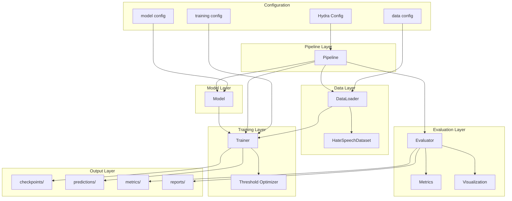
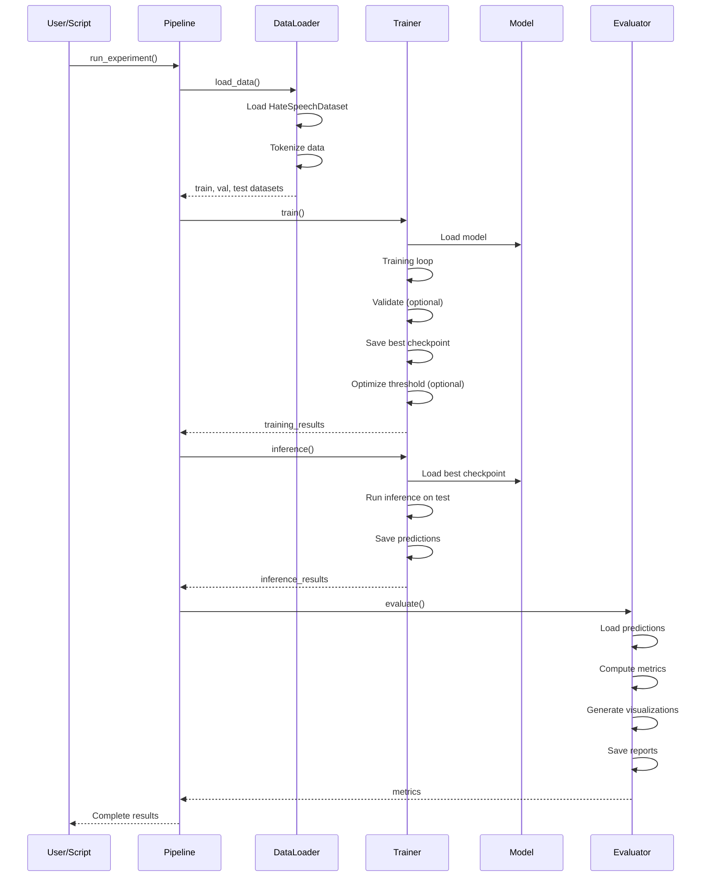
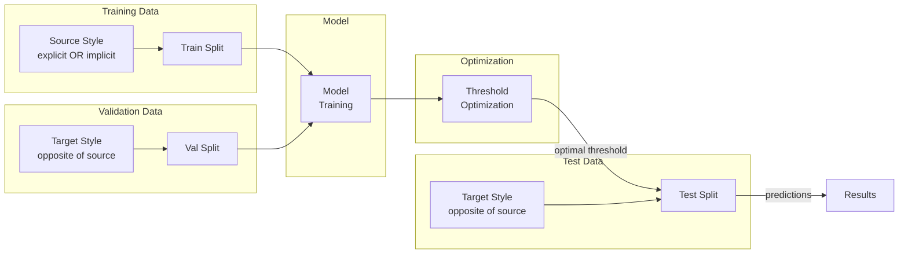
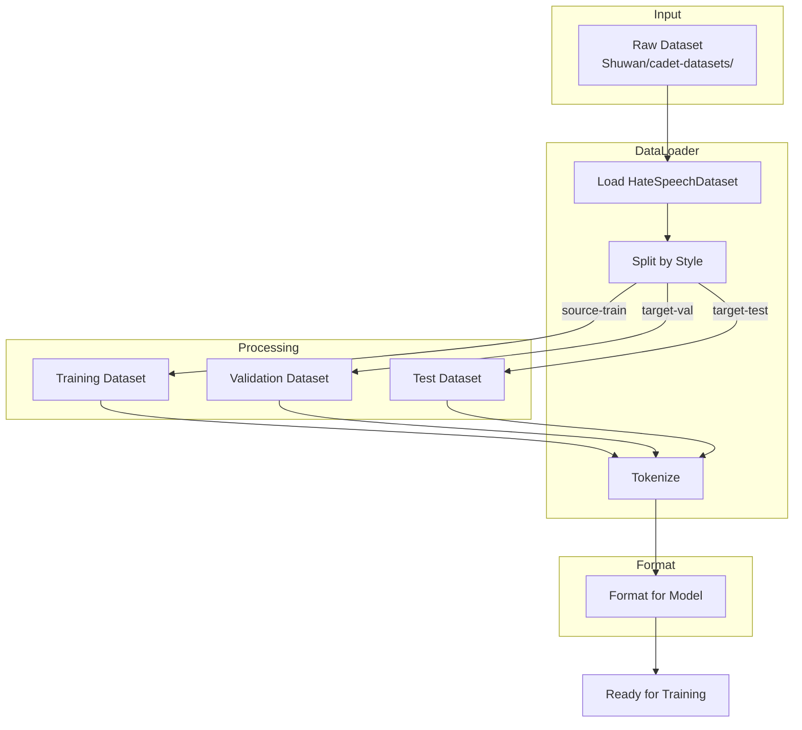

# CADET Framework Architecture

This document provides architectural diagrams and flow charts for the
CADET framework, illustrating the system design, data flows, and component interactions.

## 1. High-Level System Architecture

## 2. Training Pipeline Flow

## 3. Cross-Style Training Strategy

**Flow**:

1. Train on **source_style** (e.g., explicit hate speech)
2. Validate on **target_style** (e.g., implicit hate speech)
3. Optimize threshold on validation set
4. Test on **target_style** with fixed threshold

## 4. Data Flow Diagram

