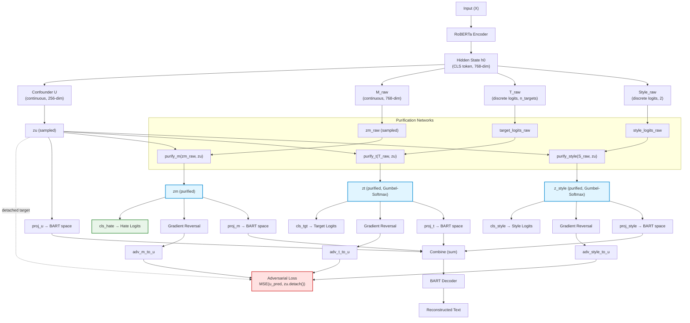
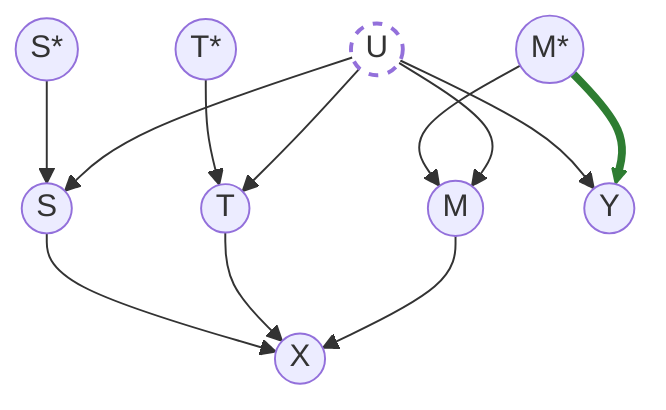

# CADET Model Design

## Overview

CADET (**C**ausal-**A**ware **D**isentanglement for **E**xplicit/implicit **T**ransfer) is a
causally-aligned model that learns disentangled representations of hate speech to enable
cross-style generalization (explicit <-> implicit) and counterfactual reasoning. The model
enforces a causal structure where hate detection depends only on content motivation, not on writing
style level or target demographics.

## 1. Data Pipeline

### CADETLoader

Simplified data loader that prepares data for CADET training:

**Key Features:**

- **Dual Tokenization**: RoBERTa (encoder) + BART (decoder) tokenization
- **Target Filtering**: Only includes examples with `target_conf ≥ 0.9`
- **Cross-Style Splits**: Trains on one style level (e.g, explicit), tests on opposite (implicit)
- **Balanced Sampling**: Trainer uses BalancedSampler to ensure equal hate/non-hate per batch

**Data Flow:**

1. Load dataset using HuggingFace datasets library
2. Filter by target confidence threshold
3. Split by style field for train/test
4. Apply dual tokenization
5. Return (train, test, test) - trainer handles balanced sampling

## 2. Model Architecture

### CADET Model

**High-Level Architecture:**



**Model Checkpoints:**

- **Encoder**: `roberta-base` or custom fine-tuned RoBERTa checkpoint
- **Decoder**: `facebook/bart-base` or custom fine-tuned BART checkpoint

**Latent Variables** (Disentangled Representations):

| Variable | Type | Dimension | Purpose |
|----------|------|-----------|---------|
| **M (Motivation)** | Continuous | 768 | Hate-related intent |
| **T (Target)** | Discrete | n_targets | Demographic target |
| **Style** | Discrete | 2 | Explicit/Implicit |
| **U (Confounder)** | Continuous | 256 | Spurious correlations |

**Key Design Principles:**

1. **Causal Structure**: Enforce M -> Hate (not T, Style, or U)
2. **Confounder Mitigation**: Adversarial training removes U's influence
3. **Purification**: Remove confounder from M, T, Style before use
4. **Orthogonality**: Ensure M ⊥ T ⊥ Style ⊥ U (mutual independence)

**Key Components:**

- **Gradient Reversal Layer**: For adversarial training
- **Purification Networks**: Remove confounder influence from latents
- **Gumbel-Softmax**: Differentiable sampling for discrete variables (T, Style)
- **Orthogonality Projections**: Enforce disentanglement constraints

## 3. Training Pipeline

### Loss Function

CADET uses 9 loss components with progressive weighting and modular design for ablation studies:

| Loss Component | Purpose | Base Weight | Progressive |
|----------------|---------|-------------|-------------|
| 1. Reconstruction | BART token prediction | 0.5 | Ramps 0->1 by epoch 5 |
| 2. Hate Classification | From purified M only | 2.0 | Active from start |
| 3. Target Classification | Weighted by confidence | 0.5 | Active from start |
| 4. Style Classification | Explicit/implicit | 1.0 | Active from start |
| 5. KL Divergence | M, T, Style, U regularization | 0.1 | Ramps 0->1 by epoch 6 |
| 6. Orthogonality | Disentanglement M⊥T⊥Style⊥U | 3.0 | Active from epoch 3 |
| 7. Counterfactual | Stable across style flips | 0.5 | Active from start |
| 8. Cycle Reconstruction | Bidirectional transformation | 0.5 | Active from start |
| 9. Adversarial | Remove U's influence | 1.0 | Ramps 0.1->1 by epoch 5 |

**Modular Design for Ablation Studies:**

The trainer supports dropping specific losses via configuration:

```yaml
training:
  drop_losses: ["counterfactual", "cycle"]  # Drop these for ablation study
```

### Progressive Training Schedule

**3-Stage Training** with dynamic loss weights for stable convergence:

| Stage | Epochs | Reconstruction | KL | Orthogonality | Adversarial | Focus |
|-------|--------|----------------|----|--------------:|-------------|-------|
| **Warm-up** | 1-2 | 20%->40% | 0% | 0% | 10% | Basic reconstruction |
| **Constraints** | 3-4 | 60%->80% | Ramp-up | 100% | 25%->50% | Disentanglement |
| **Full Training** | 5+ | 100% | 100% | 100% | 100% | Causal alignment |

**Key Training Features:**

- **Early Stopping**: Monitor validation F1, patience=5 epochs
  - **Important**: Do NOT early stop before epoch 5 (during scheduling phase)
- **Epoch Evaluation**: Uses HuggingFace `evaluate` library
- **Best Model**: Saved based on validation F1 score
- **Checkpoints**: Saved to `checkpoints/best/`

## 4. Validation & Inference

### Validation Strategy

**Cross-Style Evaluation:**

- Train on one style level (e.g., explicit)
- Validate on opposite level (e.g., implicit)
- Threshold optimization: Test 19 thresholds [0.05, 0.10, ..., 0.95], select best F1

**Evaluation Approach:**

- Epoch-wise evaluation using HuggingFace `evaluate` library
- Skip evaluation before epoch 5 (during scheduling phase)
- Monitor validation F1 for best model selection

## 5. Evaluation

### CausalEvaluator

The CausalEvaluator extends EnhancedEvaluator with complete causal analysis for CADET.
It verifies the intended causal structure, generates rich visualizations, and augments
standard metrics with causal insights.

Key capabilities:

- Causal alignment verification: trains linear probes on latents to ensure M (motivation)
  is the strongest predictor of hate vs U (confounder), T (target), and S (style)
- Confounder mitigation check: validates U is significantly weaker than M
  (default margin 0.1)
- Visualizations:
  - causal_alignment.png: bar chart of probe accuracies across latents (M, T, S, U)
  - latent_tsne.png: 2x2 t-SNE plots for latent spaces colored by hate labels
  - training_losses.png: epoch-averaged total loss with progressive schedule annotations
    (bottom legend)
  - tsne_plot.png: embeddings t-SNE (if embeddings.npz present)
- Outputs: enriches the metrics dict with causal_analysis and plot paths; also writes
  training_loss_summary.json

Expected evaluator inputs (produced by trainer/inference):

- models/latents.npz: zm, zu, zt, z_style, hate_labels, text_ids, style_labels + metadata
- models/embeddings.npz: embeddings, labels + metadata (optional; for embeddings t-SNE)
- models/training_losses.csv: batch-level loss tracking (epoch, batch, total_loss, components)

Usage example:

```python
from cadet.evaluation.causal_evaluator import CausalEvaluator

evaluator = CausalEvaluator(output_path=run_dir, enable_embeddings=True)
results = evaluator.evaluate_with_causal_analysis(
    predictions_file="test_predictions.csv",
    latents_file="latents.npz",
    generate_visualizations=True,
)
causal = results["causal_analysis"]
print("Properly aligned:", causal["properly_aligned"])  # Expect True when M >> {U,T,S}
```

## 6. Pipeline Integration

### CADETPipeline

Follows existing pipeline patterns from `SimpleBaselinePipeline` and `LLMGuardPipeline`.

**Key Requirements:**

- Aggressive `run.json` updates to reflect status changes
- Standard 5-step pipeline: Data -> Train -> Validate -> Inference -> Evaluate
- Component decoupling: Separate Loader, Trainer, Evaluator instances
- Hydra configuration management
- Standardized output directory structure

**Pipeline Flow:**

1. Initialize CADETLoader (dual tokenization, target filtering)
2. Initialize CADET model (from checkpoints)
3. Train with CADETTrainer (progressive schedule, drop_losses support)
4. Run inference (extract predictions and latents)
5. Evaluate with CausalEvaluator (standard metrics, future causal analysis)

**Usage:**

```bash
# Run CADET experiment
python scripts/run_experiments.py -cn=cadet

# Ad-hoc testing
python scripts/run_experiments.py -cn=cadet +adhoc.n_samples=100

# Multirun for ablation studies
python scripts/run_experiments.py -cn=cadet_multirun
```

## 7. Theory



**Node definitions**

- $X$: observed text (the input; tokenized and encoded by the model)
- $Y$: observed hate label
- $U$: unobserved domain/context variable (dashed node), e.g., platform norms, moderation policy
- $M, T, S$: motivation, target, style representations (domain-contaminated)
- $M^*, T^*, S^*$: purified representations

## 8. Configuration

See [configs/README.md](/configs/README.md) for detailed configuration options

## 9. Implementation Details

- [CADET Model](/src/cadet/models/cadet.py)
- [CADET Trainer](/src/cadet/training/cadet_trainer.py)
- [CADET Pipeline](/src/cadet/pipeline/cadet_pipeline.py)
